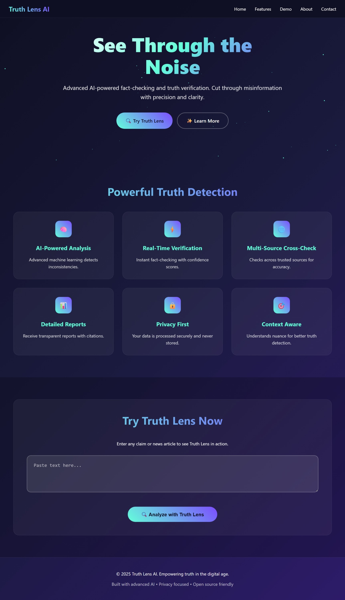
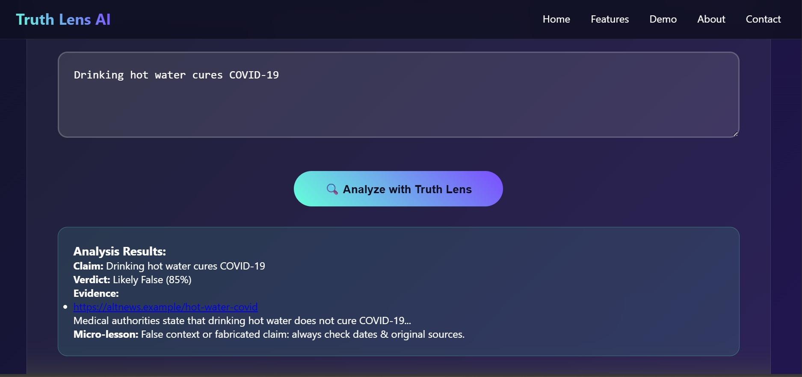

# TruthLensAI  
**An AI-powered tool to detect misinformation and educate users on digital credibility**

---

##  Problem Statement
The rapid spread of fake news and misinformation across social media and messaging platforms poses a serious threat in India. Misinformation can lead to social unrest, public health crises, and financial scams. A key challenge is the lack of accessible tools that help users quickly verify content and understand *why* certain information may be misleading.

---

##  Solution Overview
**TruthLensAI** is a Generative AI-powered web application built using **Google Cloud** that empowers users to:
- Detect potentially misleading or false content
- Understand the reasoning behind misinformation detection
- Learn common manipulation techniques used in fake news
- Develop critical thinking and digital literacy skills

Rather than acting as a simple fact-checker, TruthLensAI focuses on **education, explainability, and trust**.

---

##  Key Features
-  **Multi-Input Verification**
  - Paste text or URLs
-  **AI-Based Misinformation Detection**
  - Classifies content as:
    - Likely Safe
    - Potentially Misleading
    - Likely Misinformation
-  **Explainable AI**
  - Clear, neutral explanations of *why* content may be misleading
-  **Evidence & Fact-Check Retrieval (RAG)**
  - Links to verified fact-checks and credible sources
-  **Teach Mode**
  - Identifies manipulation techniques such as:
    - Clickbait headlines
    - Out-of-context images
    - False statistics
    - Misattributed quotes
  - Provides simple verification tips
-  **Multilingual Support**
  - English and Hindi
-  **Privacy-First Design**
  - User content is not stored permanently

---

##  System Architecture

### Frontend
- React.js (Web Interface)

### Backend
- Python (Flask)

### Google Cloud & AI Stack
- **Vertex AI (Generative AI)** – Explanation and educational content generation
- **Vertex AI Embeddings** – Semantic similarity search

---

##  Workflow
1. User submits text
3. Content is embedded and matched against known fact-checks
4. Vertex AI generates:
   - Misinformation likelihood
   - Explanation
   - Supporting evidence and sources
   - Educational tips
5. Results are displayed in an easy-to-understand interface

---

##  Datasets Used
- **FactDrill** – Indian social media fact-check dataset
- **FactDRIL** – Multilingual misinformation dataset for Indian languages
- **IFCN ClaimReview** – Verified global fact-checks

Datasets are used for retrieval, evaluation, and benchmarking.

---

##  Evaluation Metrics
- Precision of misinformation classification
- Recall of relevant fact-checks
- Latency (target: < 5 seconds for text input)
- Human evaluation of explanation usefulness

---

##  Ethics & Safety
- Explanations are evidence-based and non-judgmental
- No absolute truth claims are made
- Transparent disclaimers about AI limitations
- Designed to educate rather than censor or shame

---

##  Getting Started

### Prerequisites
- Google Cloud account
- Enabled APIs:
  - Vertex AI
- Node.js
- Python 3.9+

### Installation
```bash
git clone https://github.com/eknoor-kaur-kohli/TruthLensAI
cd TruthLensAI
```
## Demonstration

Here's the mock demo showed at Vishesh 2K25 which is available at sample_data.py

